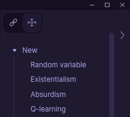
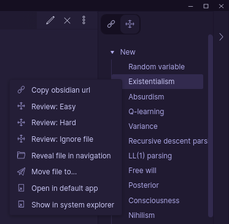

# Obsidian Spaced Repetition Plugin


Fight the forgetting curve & note aging by reviewing notes using spaced repetition on Obsidian.md 

## "Philosophy"

- Notes should be atomic i.e. focus on a single concept.
- Notes should be highly linked.
- Reviews should start only after properly understanding a concept.
- Reviews should be [Feynman-technique](https://fs.blog/2021/02/feynman-learning-technique/)-esque.

## Guide

Spaced repetition? [Basics](https://ncase.me/remember/), [Detailed](https://www.gwern.net/Spaced-repetition).


### Installation

Once the plugin goes through the review process, you can easily install the plugin from Obsidian's community plugin section in the Obsidian app.
For now, create an `obsidian-spaced-repetition` folder under `.obsidian/plugins` in your vault. Add the `main.js`, `manifest.json`, and the `styles.css` files from the [latest release](https://github.com/st3v3nmw/obsidian-spaced-repetition/releases) to the folder.

### Usage

#### New Notes

All "new" notes are listed under `New` on the right pane (Review Queue). Like so:



#### Reviewing

Open the file & review it. Once done, choose either the `Review: Easy` or the `Review: Hard` option on the file menu (the three dots). The `Easy` or `Hard` depend on how well you comprehend the material being reviewed.


Alternatively, you can right click on the file and access the same options:



The note will then scheduled appropriately:


#### Scheduled notes

`Review: N due` on the status bar at the bottom of the screen shows how many notes one has to review today (Today's notes + overdue notes). Clicking on that opens one of the notes for review.

Alternatively, one can use the `Open a note for review` command.

#### Review Settings

Available settings are:
- Choosing whether to open a note at random or the most important note
- Choosing whether to open the next note automatically after reviewing another

### Ignoring some notes

To exclude some notes from the scheduling & review process, click the `Review: Ignore file` option on the file menu:


Alternatively, add the following frontmatter to the very top of the note:

```yaml
---
review: false
---
```

### Review Queue

- Daily review entries are sorted by importance (PageRank)

## Spaced Repetition Algorithm

- The algorithm is a variant of [Anki's algorithm](https://faqs.ankiweb.net/what-spaced-repetition-algorithm.html) which is based on the [SM-2 algorithm](https://www.supermemo.com/en/archives1990-2015/english/ol/sm2).
- It supports binary reviews i.e. a concept is either hard or easy at the time of review.
- initial ease is weighted (using max_link_factor) depending on the average ease of linked notes, note importance, and the base ease.
  - `if link_count > 0: initial_ease = (1 - link_contribution) * base_ease + link_contribution * average_ease`
    - `link_contribution = max_link_factor * min(1.0, log(link_count + 0.5) / log(64))` (cater for uncertainty)
  - The importance of the difference concepts/notes is determined using the PageRank algorithm (not all notes are created equal xD)
    - On most occasions, the most fundamental concepts/notes have higher importance
- If the user reviews a concept/note as:
  - easy, the ease increases by `20` and the interval changes to `old_interval * new_ease / 100`
  - hard, the ease decreases by `20` and the interval changes to `old_interval * 0.5`
    - The `0.5` can be modified in settings
    - `minimum ease = 130`
  - For `8` or more days:
    - `interval += random_choice({-fuzz, 0, +fuzz})`
      - where `fuzz = ceil(0.05 * interval)`
      - [Anki docs](https://faqs.ankiweb.net/what-spaced-repetition-algorithm.html):
        > "[...] Anki also applies a small amount of random “fuzz” to prevent cards that were introduced at the same time and given the same ratings from sticking together and always coming up for review on the same day."
- The scheduling information is stored in the YAML front matter
